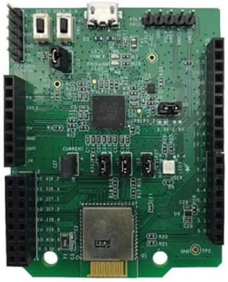

# CYBLE-416045-EVAL BSP

## Overview

The EZ-BLE Arduino Evaluation Board (CYBLE-416045-EVAL) enables you to evaluate and develop applications on the CYBLE-416045-02 EZ-BLE Creator Module. CYBLE-416045-EVAL can be used as a standalone evaluation kit or can be combined with Arduino compatible shields.

To use code from the BSP, simply include a reference to `cybsp.h`.

## Features

### Kit Features:

* BLE 5.0 certified CYBLE-416045-02 EZ-BLE module with onboard crystal oscillators, trace antenna, passive components and PSoC™ 63 MCU
* Up to 36 Arduino-compatible GPIO headers
* Supports digital programmable logic, a PDM-PCM digital microphone interface, high-performance analog-to- digital converter (ADC), low-power comparators, and standard communication and timing peripherals.

### Kit Contents:

* EZ-BLE Arduino Evaluation Board (CYBLE-416045-EVAL) with on-board EZ-BLE Creator Module (CYBLE-416045-02)
* USB Type-A to Micro-USB cable
* Quick Start Guide

## BSP Configuration

The BSP has a few hooks that allow its behavior to be configured. Some of these items are enabled by default while others must be explicitly enabled. Items enabled by default are specified in the CYBLE-416045-EVAL.mk file. The items that are enabled can be changed by creating a custom BSP or by editing the application makefile.

Components:
* Device specific category reference (e.g.: CAT1) - This component, enabled by default, pulls in any device specific code for this board.

Defines:
* CYBSP_WIFI_CAPABLE - This define, disabled by default, causes the BSP to initialize the interface to an onboard wireless chip if it has one.
* CY_USING_HAL - This define, enabled by default, specifies that the HAL is intended to be used by the application. This will cause the BSP to include the applicable header file and to initialize the system level drivers.
* CYBSP_CUSTOM_SYSCLK_PM_CALLBACK - This define, disabled by default, causes the BSP to skip registering its default SysClk Power Management callback, if any, and instead to invoke the application-defined function `cybsp_register_custom_sysclk_pm_callback` to register an application-specific callback.

### Clock Configuration

| Clock    | Source    | Output Frequency |
|----------|-----------|------------------|
| FLL      | IMO       | 100.0 MHz        |
| PLL      | IMO       | 48.0 MHz         |
| CLK_HF0  | CLK_PATH0 | 100 MHz          |

### Power Configuration

* System Active Power Mode: LP
* System Idle Power Mode: Deep Sleep
* VDDA Voltage: 3300 mV
* VDDD Voltage: 3300 mV

See the [BSP Setttings][settings] for additional board specific configuration settings.

## API Reference Manual

The CYBLE-416045-EVAL Board Support Package provides a set of APIs to configure, initialize and use the board resources.

See the [BSP API Reference Manual][api] for the complete list of the provided interfaces.

## More information
* [CYBLE-416045-EVAL BSP API Reference Manual][api]
* [CYBLE-416045-EVAL Documentation](https://www.cypress.com/documentation/development-kitsboards/cyble-416045-eval-ez-ble-arduino-evaluation-board)
* [Cypress Semiconductor, an Infineon Technologies Company](http://www.cypress.com)
* [Infineon GitHub](https://github.com/infineon)
* [ModusToolbox™](https://www.cypress.com/products/modustoolbox-software-environment)

[api]: https://infineon.github.io/TARGET_CYBLE-416045-EVAL/html/modules.html
[settings]: https://infineon.github.io/TARGET_CYBLE-416045-EVAL/html/md_bsp_settings.html

---
© Cypress Semiconductor Corporation (an Infineon company) or an affiliate of Cypress Semiconductor Corporation, 2019-2022.